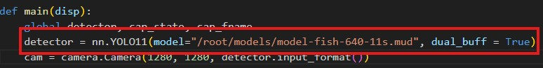
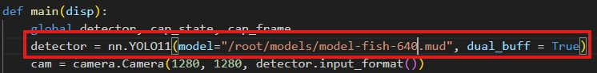
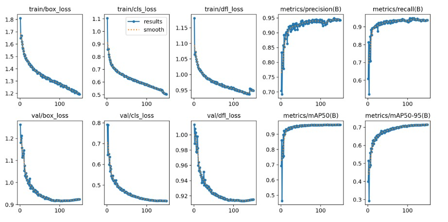

# Maixcam-fingerlings-detection
Contain models and py script to run in Maixcam for fingerlings detection. Upload .mud and .cvimodel into your maixcam and run the script.

#### Press user button to start detecting

#### Model was train on Google Colab with Roboflow API converted into onnyx format for more info please visit [https://github.com/San279/Roboflow-to-maixcam](https://github.com/San279/Roboflow-to-maixcam)

#### To switch between models please change line 50 in main.py to the desired model
##### Switch to 11s

##### Switch to 11n

###### Results for yolo11n (faster but less accurate)

###### Results for yolo11s (slower but more accurate)

