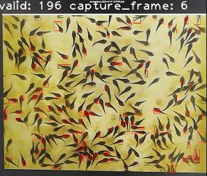

# Maixcam-fingerlings-detection
Contain models and py script to run in Maixcam for fingerlings detection. Upload .mud and .cvimodel into your maixcam and run the script.
#### Press user button to start detecting

